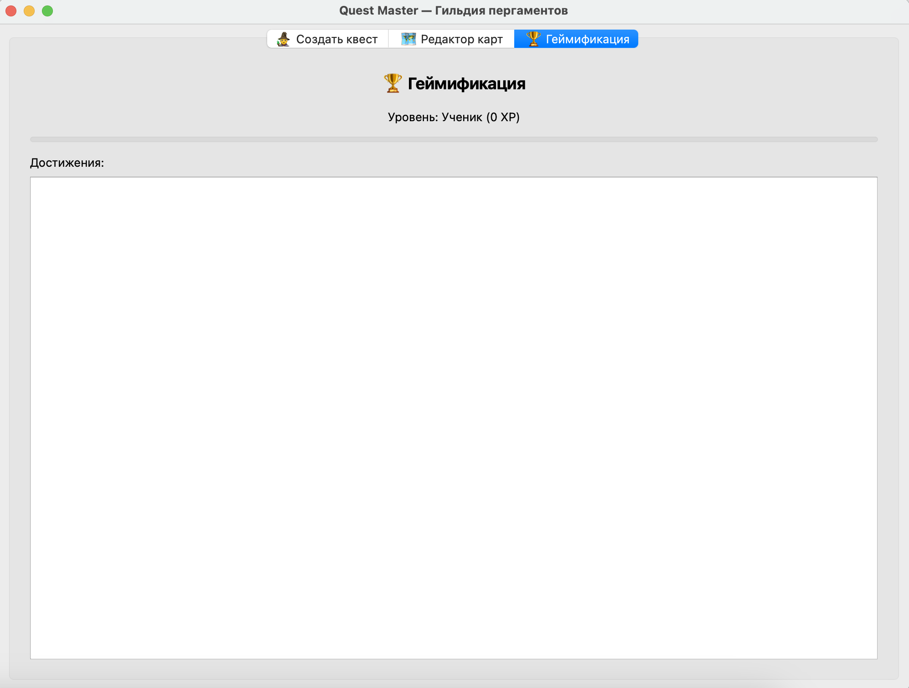
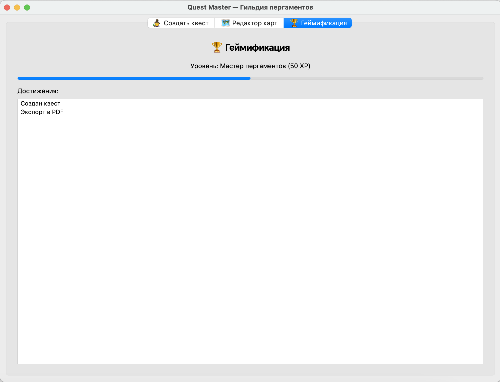
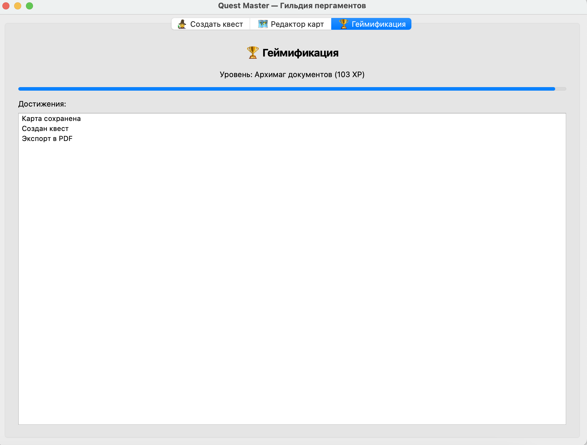
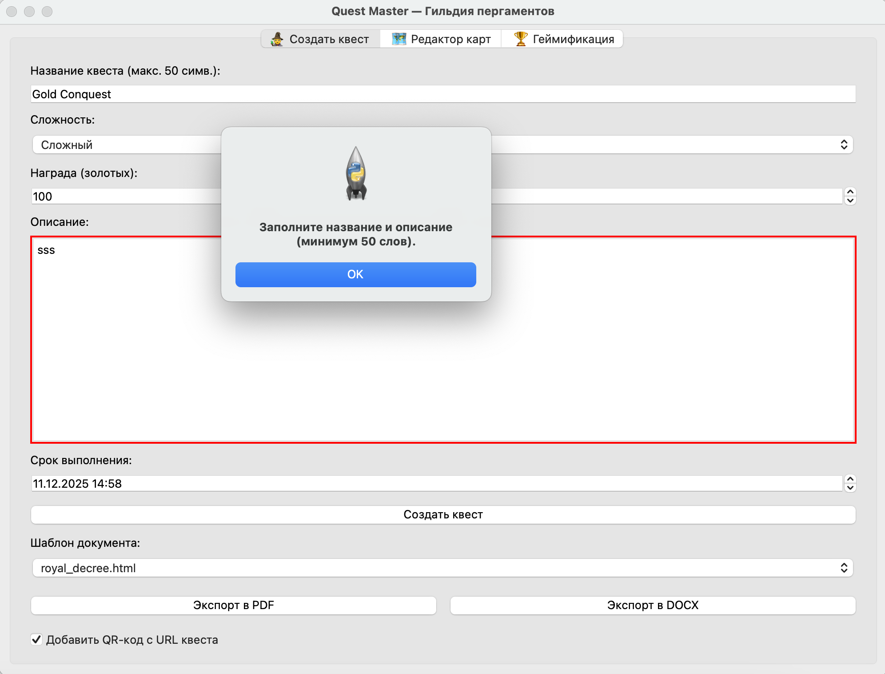

# Quest Master — Генератор квестов

Автоматизация создания квестовых заданий для Гильдии пергаментов и заклинаний.

---

## ✨ Функционал

- 🧙 Создание квестов с валидацией (название, описание ≥50 слов, сложность, награда, дедлайн)
- 💾 Автосохранение в SQLite с историей изменений (`quests` и `quest_versions`)
- 📄 Экспорт в PDF и DOCX через HTML-шаблоны Jinja2:
  - `royal_decree.html` — Королевский указ
  - `guild_contract.html` — Контракт Гильдии
  - `ancient_scroll.html` — Древний свиток
- 🗺️ Редактор карт (800×600):
  - Рисование путей
  - Маркеры: город (зелёный), подземелье (красный), таверна (жёлтый)
  - Текстовые метки шрифтом *Uncial Antiqua*
  - Сохранение как PNG/JPG
- 🏆 Геймификация:
  - Уровни: *Ученик* → *Мастер пергаментов* → *Архимаг документов*
  - XP за действия (квест, экспорт, карта)
  - Прогресс-бар и список достижений
- ⚔️ Босс-файт: генерация 100 квестов за <5 секунд (+20 XP)

---

## 🛠️ Технологии

- **GUI**: PyQt6  
- **Шаблоны**: Jinja2  
- **Экспорт**: `weasyprint` (PDF), `python-docx` (DOCX)  
- **База данных**: SQLite3 (stdlib)  
- **Дополнительно**: `qrcode[pil]` (для QR-кодов), `pytest` (тесты)

---

## ▶️ Установка и запуск

1. Клонируйте репозиторий:
   ```bash
   git clone https://github.com/ваш-логин/quest_master.git
   cd quest_master
   ```

2. Создайте и активируйте виртуальное окружение:

   **На macOS / Linux**:
   ```bash
   python3 -m venv venv
   source venv/bin/activate
   ```

   **На Windows**:
   ```powershell
   python -m venv venv
   venv\Scripts\activate
   ```

3. Установите зависимости:
   ```bash
   pip install -r requirements.txt
   ```

4. Запустите приложение:
   ```bash
   python main.py
   ```

5. Запустите тест «Босс-файт»:
   ```bash
   python -m pytest tests/test_boss_fight.py -v
   ```

---

## 📁 Структура проекта

```
quest_master/
├── main.py
├── gui/
│   ├── main_window.py
│   ├── quest_wizard.py
│   ├── map_editor.py
│   └── gamification_panel.py
├── core/
│   ├── database.py
│   ├── template_engine.py
│   └── gamification.py
├── templates/
│   ├── royal_decree.html
│   ├── guild_contract.html
│   └── ancient_scroll.html
├── assets/
│   └── fonts/         # Uncial Antiqua
├── tests/
│   └── test_boss_fight.py
├── parchments/        # Экспортированные документы (создаётся автоматически)
├── quests.db          # База данных (создаётся автоматически)
└── requirements.txt
```

---

## 🎮 Уровни геймификации

| Уровень                | XP    |
|------------------------|-------|
| Ученик                 | 0     |
| Мастер пергаментов     | 50    |
| Архимаг документов     | 100   |

---

## 📸 Демонстрация

### Уровни геймификации

| Ученик (0 XP) | Мастер пергаментов (50 XP) | Архимаг документов (100 XP) |
|---------------|-----------------------------|------------------------------|
|  |  |  |
| Валидация | 
|  |

### Видео-демо

[](demo.mp4)

> ⚠️ Видео в формате `.mp4`  
> Альтернатива: [скачать демо](demo.mp4)
